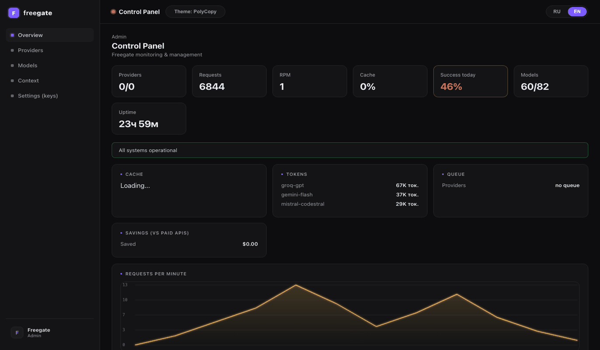
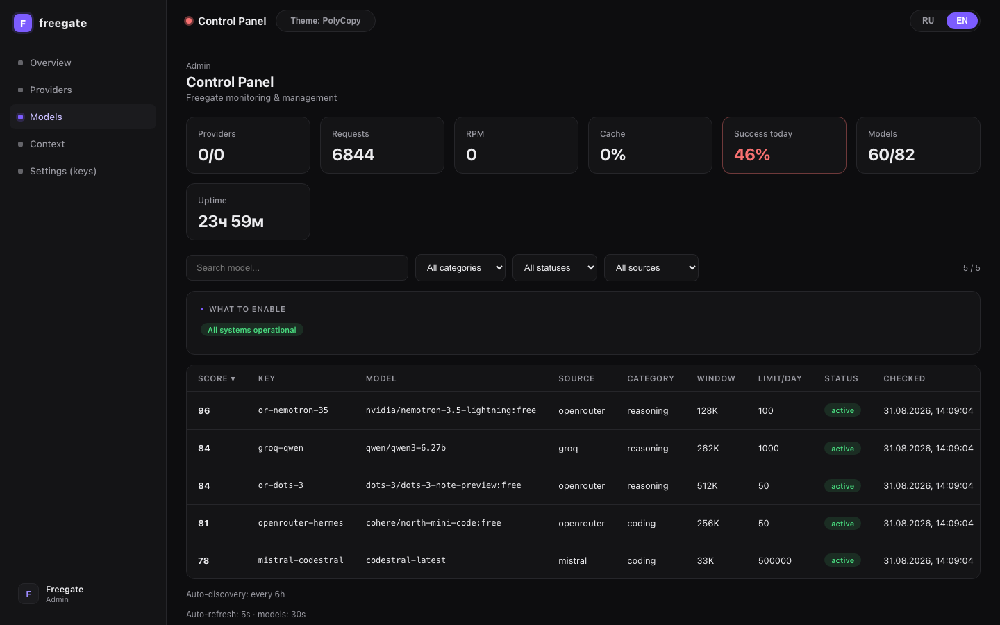

# Freegate

[](https://github.com/Artur21101965/freegate/actions)
[](https://hub.docker.com/r/nik951751/freegate)
[](https://opensource.org/licenses/MIT)
[](https://www.npmjs.com/package/freegate)
[](https://github.com/Artur21101965/freegate)
[](/#features)
[](/#why-free)
[](/#private)

**[Русская версия](README.ru.md) · Russian version**

## Why pay for LLMs when free ones exist?

Your AI agent, bot, or script talks to a **single OpenAI-compatible endpoint**.
Behind it, Freegate automatically routes requests across **34 free models**
from Groq, Mistral, Gemini, NVIDIA NIM, OpenRouter, ZAI, Cerebras, DeepSeek
and local models. If one provider goes down, gets overloaded, or burns its
daily limit — the request **instantly falls through to the next one**. You
never see "rate limit", and you never pay.

**Result:** full LLM access for everyday work at the price of **$0**.

### 🔒 Runs locally — your conversations never leave your machine

Freegate runs **on your machine** (`http://localhost:4000`). Your `localhost`
is only yours — nobody else can connect to it, and you can't to theirs. Provider
keys live in your local `.env`, history in local files. **No third-party server
sees your keys or conversations.**



## Features

| | |
|---|---|
| 🔀 **Auto-failover** | 34 providers in one chain. Provider down? The next one answers. |
| 🤖 **Self-managing models** | Auto-discovers new free models, tests them, adds working ones, disables dead ones — built-in scheduler, always-fresh model base. |
| 🗂️ **Model database** | Structured passport per model (score, latency, context window, history) + sorting: best models get routing priority. |
| 🏷️ **Model categories** | reasoning / coding / general / vision / local — the right model for the right job. |
| 🖼️ **Two-stage vision** | Screenshot → vision model reads it → coding model answers the fix. |
| 💰 **Free** | Free models only. The dashboard shows each provider's remaining limit. |
| ⚡ **Smart routing** | Picks the fastest, most stable provider for every request. |
| 🛡️ **Reliability** | Circuit breaker, request queue, auto-disable of dead providers, watchdog. |
| 📊 **Dashboard** | Status, speed, limits, history, tokens, RPM chart, savings ($). RU/EN. **4 themes** (PolyCopy/Warm/Cosmic/Paper) — switcher in the header. |
| 💾 **Disk cache** | Repeat prompts don't consume limits at all. |
| 🎓 **Methodologist** | Agent answers like an engineer: plan→test→code (coding), stepwise (reasoning), like a frontend designer (design). Prompts customizable in `config.json`. |
| 🌐 **Web search** | For question/answer it fetches current facts from the web (DuckDuckGo, keyless) — answers accurately instead of hallucinating. |
| 🧪 **Self-check** | Optional: complex answers are vetted by a second model (vetting) and flagged on error. Enable: `config.vetting.enabled`. |
| 📈 **Sparkline 24h** | Hourly success in the dashboard + history filters (search by model/provider, OK/Errors). |
| 🔌 **Compatible** | Any OpenAI client: opencode, Cursor, your scripts. |



## Quick start — 30 seconds

```bash
npx freegate init -i     # wizard: quick (1 OpenRouter key) or full (all keys)
npx freegate start       # proxy on http://localhost:4000
npx freegate test        # verify everything works
```

**init modes:**
- **quick** — one OpenRouter key → 15+ free models instantly. Add more keys later in Dashboard → Settings.
- **full** — all provider keys → 8 sources, max speed and reliability (auto-failover).

**Connect to Cursor in 2 clicks:** Cursor → Settings → Models → "OpenAI-compatible" → Base URL `http://localhost:4000/v1`, API Key = your password.

Dashboard: `http://localhost:4000/?key=your_password`

Or via Docker:

```bash
docker run -d --name freegate -p 4000:4000 \
  -e PROVIDER_GROQ_APIKEY=... \
  -e PROVIDER_MISTRAL_APIKEY=... \
  -e AUTH=your-secret-key \
  nik951751/freegate
```

### Connect any OpenAI client

| Field | Value |
|-------|-------|
| Base URL | `http://localhost:4000/v1` |
| API Key | your password from `init` |
| Model | `tier-s` (fast) / `tier-splus` (powerful) |

Example for opencode (`~/.config/opencode/opencode.jsonc`):

```jsonc
{
  "provider": {
    "free-proxy": {
      "npm": "@ai-sdk/openai-compatible",
      "name": "Freegate",
      "options": {
        "baseURL": "http://localhost:4000/v1",
        "apiKey": "your-secret-key-here"
      },
      "models": {
        "tier-splus": { "name": "Freegate (Best)", "input": ["text"] },
        "tier-s": { "name": "Freegate (Fast)", "input": ["text"] }
      }
    }
  }
}
```

## Supported providers

| Provider | Models | Where to get key | Limit/day |
|----------|--------|------------------|-----------|
| Groq | gpt-oss-120b, qwen-27b, allam-2-7b, compound | console.groq.com | 1000 |
| Mistral | codestral, small | console.mistral.ai | 500K tok |
| NVIDIA NIM | llama, vision | build.nvidia.com | 40 |
| Gemini | gemini-3.6-flash, vision | aistudio.google.com | 1500 |
| OpenRouter | cohere-north, glm, nemotron, ox-alpha, dots-3, lfm, laguna | openrouter.ai | 50-100 |
| ZAI | glm-4.7-flash | open.bigmodel.cn | 1000 |
| Cerebras | gpt-oss-120b, gemma-4-31b | cloud.cerebras.ai | 1000 |
| DeepSeek | deepseek-v4-flash, vision | platform.deepseek.com | 1000 |
| Local | Ollama, LM Studio | — | unlimited |

**New free models are discovered, tested, and added automatically** — no need
to watch for new releases. The model manager runs every 6 hours.

> The catalog is extensible: add a model to `providers.json` and it joins the pool.
> Providers unavailable to your key (404) are auto-disabled.

## How it works

1. A request arrives at `/v1/chat/completions` (OpenAI format).
2. Freegate picks the best provider: healthy, under limit, fastest today.
3. If it fails — instantly tries the next one in the chain.
4. The response returns in the same format — the client never notices.

### Methodologist (Productive Agent Layer)

Freegate classifies the task (coding / design / reasoning / search / chat) and injects a
short system-prompt methodologist **without any client-side changes**. Any
OpenAI-compatible client (opencode, Cursor, chat) gets engineer-grade answers:

- **coding** — brief plan before code, a suggested test, where to verify.
- **design** — bold aesthetic idea, distinctive fonts, cohesive palette via CSS variables, choreographed motion, responsive. Inspired by Anthropic `frontend-design`.
- **reasoning** — reason stepwise, show assumptions.
- **search** — short factual answer, don't invent sources.
- **chat** — to the point, concise.

A shared **"don't give up"** block is prepended to every category: if the model
can't find a tool/file/skill where it expected one, it doesn't refuse — it looks
for a workaround (reads files directly, checks node_modules, tries alternatives).
This makes free models act resourcefully instead of ending with "I can't".

The task category also nudges routing toward matching provider categories
(`coding`→coding models, `reasoning`→reasoning models) without dropping fallback.
Category distribution is visible on the dashboard and via
`node tools/context-diag.js`.

> Methodologist prompts are a condensed derived text inspired by
> [superpowers](https://github.com/obra/superpowers) (MIT). Full agentic cycle
> (tools, subagents) runs on the client side.

### Self-updating model database

The scheduler lives inside the server — always on, no cron/launchd needed,
works for every npm/Docker user. Every 6 hours (configurable) Freegate:

1. **Checks existing** models: dead ones (404/402) get disabled.
2. **Re-checks dead** models after 7 days — if the provider restores a model, it's re-enabled automatically.
3. **Scans 8 sources**: OpenRouter, HuggingFace + native model lists of Groq, Mistral, Gemini, Cerebras, DeepSeek, NVIDIA NIM.
4. **Tests new candidates** in parallel and adds the working ones.
5. **Computes a score** (success rate + latency + context window + freshness) and sorts: best models get routing priority.

Manual catalog entries (your hand-set priorities in `providers.json`) are never
overwritten — sorting applies only to auto-added models.

```bash
node tools/models-db.js          # model base report
node scripts/auto-manage-models.js   # manual cycle run
```

Configuration (`config.json`):

```json
{ "modelManager": { "enabled": true, "intervalHours": 6, "autoAdd": true, "recheckDisabledDays": 7 } }
```

## Development

```bash
npm test          # unit tests (187)
node server.js    # run from source
```

## Configuration

**Keys** — only in `.env` (never committed):

```bash
PROVIDER_GROQ_APIKEY=...       # Groq
PROVIDER_MISTRAL_APIKEY=...    # Mistral
PROVIDER_GEMINI_APIKEY=...     # Gemini
PROVIDER_NIM_APIKEY=...        # NVIDIA NIM
PROVIDER_OPENROUTER_APIKEY=... # OpenRouter
PROVIDER_ZAI_APIKEY=...        # ZAI
```

**Server settings** — in `config.json` or env:

| Setting | Env | Default |
|---------|-----|---------|
| Port | `PORT` | `4000` |
| Password | `AUTH` | empty (no auth) |
| Rate limit/min | `config.json → rateLimit` | 100/min |

**Providers** — catalog in `providers.json` (18 models). Add your own:
put it in `config.json` → `providers` (same format as `providers.json`).

## CLI commands

```bash
npx freegate init              # create config
npx freegate init -i           # interactive wizard (keys, password)
npx freegate doctor            # diagnostics: keys, models, "what to check"
npx freegate start             # start proxy
npx freegate status            # diagnostics: providers, limits, errors
npx freegate test              # verify it works
npx freegate install-service   # autostart at boot
npx freegate dashboard         # open dashboard
```

## FAQ

**Is this legal?** Yes. You connect **your own** free provider keys — you just
get a single reliable gateway to all of them.

**How much does it cost?** $0. Only the free-tier limits of the providers.

**Which models are fastest?** The proxy measures and picks. Currently leading:
Qwen (Groq, ~300ms) and cohere-north (OpenRouter).

**Can I add my own provider?** Yes — add it to `config.json` or `providers.json`.

**Is it only for opencode?** No. Any OpenAI-compatible client
(see `examples/` — Cursor, Claude Code, scripts).

## Tools

### Shorts generator — `tools/generate_shorts.py`
Free vertical video (9:16) generation via **MiniMax H3** (video + sound from
one prompt) or **Wan 2.1**. Runs through Hugging Face online demos — GPU in
the cloud, no install.

```bash
cd tools
uv venv .venv && uv pip install --python .venv/bin/python -r requirements.txt
export HF_TOKEN=hf_xxx            # free: huggingface.co → settings/tokens
./.venv/bin/python generate_shorts.py "Cozy morning scene, warm light" --format 9:16 --duration 5
```

Prompt catalog: `tools/prompts.md`.

## License

MIT
