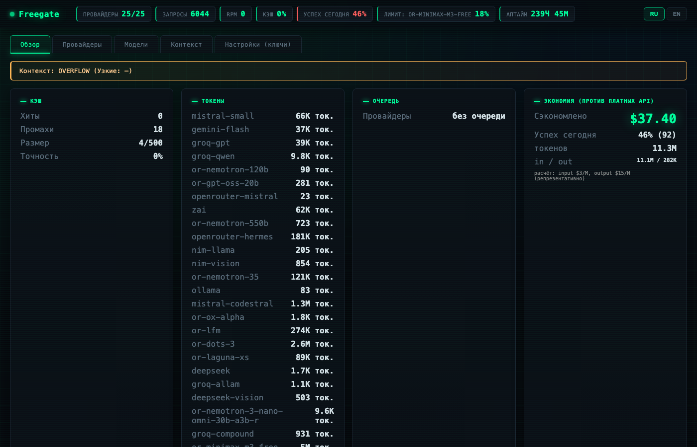

# Freegate

[](https://github.com/Artur21101965/freegate/actions)
[](https://hub.docker.com/r/nik951751/freegate)
[](https://opensource.org/licenses/MIT)
[](https://www.npmjs.com/package/freegate)

**English version: [README.md](README.md)**

## Зачем платить за LLM, когда есть бесплатные?

Твой AI-агент, бот или скрипт использует один OpenAI-совместимый endpoint.
За ним Freegate автоматически распределяет запросы между **25 бесплатными
моделями** — Groq, Mistral, Gemini, NVIDIA NIM, OpenRouter, ZAI, Cerebras,
DeepSeek и локальные модели. Если один провайдер упал, перегружен или сжёг
дневной лимит — запрос **мгновенно уходит на следующий**. Ты никогда не
видишь «rate limit», и никогда не платишь.

**Результат:** полноценный LLM-доступ для повседневной работы по цене $0.



## Возможности

| | |
|---|---|
| 🔀 **Автопереключение** | 25 провайдеров в одной цепочке. Провайдер упал? Следующий уже отвечает. |
| 🤖 **Автоуправление моделями** | Сам находит новые бесплатные модели, тестирует, добавляет рабочие, отключает мёртвые — встроенный планировщик, всегда актуальная база. |
| 🗂️ **База моделей** | Структурированный паспорт каждой модели (скор, латентность, окно, история) + сортировка: лучшие модели получают приоритет в роутинге. |
| 🏷️ **Категории моделей** | reasoning / coding / general / vision / local — правильная модель для каждой задачи. |
| 🖼️ **Vision-конвейер** | Скриншот → vision-модель читает → кодинг-модель отвечает на вопрос. |
| 💰 **Бесплатно** | Только free-модели. Дашборд показывает остаток лимита каждого провайдера. |
| ⚡ **Умный выбор** | Прокси сам находит самый быстрый и стабильный провайдер для каждого запроса. |
| 🛡️ **Надёжность** | Circuit breaker, очередь запросов, автоотключение мёртвых провайдеров, watchdog. |
| 📊 **Дашборд** | Статус, скорость, лимиты, история, токены, RPM-график. |
| 💾 **Кэш на диске** | Повторные промпты не тратят лимиты вообще. |
| 🎓 **Методолог** | Агент отвечает как инженер: план→тест→код (coding), пошагово (reasoning). Промпты настраиваются в `config.json`. |
| 🔌 **Совместимость** | Любой OpenAI-клиент: opencode, Cursor, ChatGPT-аналоги, твои скрипты. |

## Быстрый старт — 30 секунд

```bash
npx freegate init -i     # мастер: режим quick (1 ключ OpenRouter) или full (все ключи)
npx freegate start       # прокси на http://localhost:4000
npx freegate test        # проверить, что всё работает
```

**Режимы init:**
- **quick** — вставь один ключ OpenRouter → сразу 15+ бесплатных моделей. Остальные ключи добавишь позже в дашборде → «Настройки».
- **full** — все ключи провайдеров → 8 источников, максимум скорости и надёжности (авто-failover).

**Подключить к Cursor в 2 клика:** Cursor → Settings → Models → «OpenAI-compatible» → Base URL `http://localhost:4000/v1`, API Key = твой пароль.

Дашборд: `http://localhost:4000/?key=твой_пароль`

Или через Docker:

```bash
docker run -d --name freegate -p 4000:4000 \
  -e PROVIDER_GROQ_APIKEY=... \
  -e PROVIDER_MISTRAL_APIKEY=... \
  -e AUTH=your-secret-key \
  nik951751/freegate
```

### Подключение к любому OpenAI-клиенту

| Поле | Значение |
|------|----------|
| Base URL | `http://localhost:4000/v1` |
| API Key | твой пароль из `init` |
| Модель | `tier-s` (быстрая) / `tier-splus` (мощная) |

Пример для opencode (`~/.config/opencode/opencode.jsonc`):

```jsonc
{
  "provider": {
    "free-proxy": {
      "npm": "@ai-sdk/openai-compatible",
      "name": "Freegate",
      "options": {
        "baseURL": "http://localhost:4000/v1",
        "apiKey": "your-secret-key-here"
      },
      "models": {
        "tier-splus": { "name": "Freegate (Best)", "input": ["text"] },
        "tier-s": { "name": "Freegate (Fast)", "input": ["text"] }
      }
    }
  }
}
```

## Поддерживаемые провайдеры

| Провайдер | Модели | Где ключ | Лимит/день |
|-----------|--------|----------|------------|
| Groq | gpt-oss-120b, qwen-27b, allam-2-7b, compound | console.groq.com | 1000 |
| Mistral | codestral, small | console.mistral.ai | 500K ток |
| NVIDIA NIM | llama, vision | build.nvidia.com | 40 |
| Gemini | gemini-3.6-flash, vision | aistudio.google.com | 1500 |
| OpenRouter | cohere-north, glm, nemotron, ox-alpha, dots-3, lfm, laguna | openrouter.ai | 50-100 |
| ZAI | glm-4.7-flash | open.bigmodel.cn | 1000 |
| Cerebras | gpt-oss-120b, gemma-4-31b | cloud.cerebras.ai | 1000 |
| DeepSeek | deepseek-v4-flash, vision | platform.deepseek.com | 1000 |
| Локальные | Ollama, LM Studio | — | безлимит |

**Новые бесплатные модели находятся, тестируются и добавляются автоматически**
— не нужно следить за релизами. Менеджер моделей работает каждые 6 часов.

> Каталог расширяемый: добавь модель в `providers.json` — и она попадёт в пул.
> Провайдеры, недоступные твоему ключу (404), отключаются автоматически.

## Как это работает

1. Приходит запрос на `/v1/chat/completions` (формат OpenAI).
2. Freegate выбирает лучший провайдер: здоровый, под лимитом, самый быстрый сегодня.
3. Если запрос не прошёл — мгновенно пробует следующий из цепочки.
4. Ответ возвращается клиенту в том же формате — клиент ничего не замечает.

### Методолог (Productive Agent Layer)

Freegate определяет тип задачи (кодинг / рассуждение / поиск / болтовня) и
подмешивает короткий системный промпт-методолог **без изменений на стороне
клиента**. Любой OpenAI-совместимый клиент (opencode, Cursor, чат) получает
ответы как от опытного инженера:

- **coding** — краткий план перед кодом, предложенный тест, где проверять.
- **reasoning** — рассуждать пошагово, показывать допущения.
- **search** — короткий фактологичный ответ, не выдумывать источник.
- **chat** — по существу и кратко.

Дополнительно: категория задачи даёт буст моделям подходящей категории
(`coding`→coding-модели, `reasoning`→reasoning-модели), не исключая fallback.
Распределение категорий видно в дашборде и через
`node tools/context-diag.js`.

> Методолог-промпты — производный сжатый текст по мотивам
> [superpowers](https://github.com/obra/superpowers) (MIT). Полный агентный цикл
> (инструменты, субагенты) выполняется на стороне клиента.

### Самообновляющаяся база моделей

Планировщик встроен в сервер — работает всегда, без cron/launchd, у всех
пользователей пакета. Каждые 6 часов (настраивается) Freegate:

1. **Проверяет существующие** модели: мёртвые (404/402) отключаются.
2. **Перепроверяет мёртвых** через 7 дней — если провайдер вернул модель, она автоматически реактивируется.
3. **Сканирует 8 источников**: OpenRouter, HuggingFace + нативные списки Groq, Mistral, Gemini, Cerebras, DeepSeek, NVIDIA NIM.
4. **Тестирует новых кандидатов** параллельно и добавляет рабочие.
5. **Считает скор** (success-rate + латентность + контекст-окно + свежесть) и сортирует: лучшие модели получают приоритет в роутинге.

Ручные записи каталога (твои приоритеты в `providers.json`) не перезаписываются
— сортировка применяется только к автодобавленным моделям.

```bash
node tools/models-db.js          # отчёт по базе
curl -s "localhost:4000/v1/models-db?key=пароль" | python3 -m json.tool | head -30
node scripts/auto-manage-models.js   # ручной прогон цикла
AUTO_ADD=false node scripts/auto-manage-models.js  # только отчёт, без записи
```

Конфигурация (`config.json`):

```json
{ "modelManager": { "enabled": true, "intervalHours": 6, "autoAdd": true, "recheckDisabledDays": 7 } }
```

## Разработка

```bash
npm test          # unit-тесты (187 шт.)
node server.js    # запуск из исходников
```

## Конфигурация

**Ключи** — только в `.env` (не в git):

```bash
PROVIDER_GROQ_APIKEY=...       # Groq
PROVIDER_MISTRAL_APIKEY=...    # Mistral
PROVIDER_GEMINI_APIKEY=...     # Gemini
PROVIDER_NIM_APIKEY=...        # NVIDIA NIM
PROVIDER_OPENROUTER_APIKEY=... # OpenRouter
PROVIDER_ZAI_APIKEY=...        # ZAI
```

**Параметры сервера** — в `config.json` или env:

| Параметр | Env | По умолчанию |
|----------|-----|--------------|
| Порт | `PORT` | `4000` |
| Пароль | `AUTH` | пусто (нет auth) |
| Лимит запросов/мин | `config.json → rateLimit` | 100/мин |

**Провайдеры** — каталог в `providers.json` (18 моделей). Добавить свой:
впиши его в `config.json` → `providers` (формат как в `providers.json`).

**Методолог** — в `config.json`:

```json
{
  "methodology": {
    "enabled": true,
    "prompts": {
      "coding": "Перед кодом — краткий план. Следи, чтобы тест описывал поведение.",
      "reasoning": "Рассуждай пошагово, показывай допущения, затем вывод."
    }
  }
}
```

- `enabled: false` — полностью выключает методолог и роутинг-буст.
- `prompts` — переопределяет текст для конкретной категории; остальные
  остаются в дефолтах.

## Команды CLI

```bash
npx freegate init              # создать конфиг
npx freegate init -i           # интерактивный мастер (ключи, пароль)
npx freegate start             # запустить прокси
npx freegate status            # диагностика: провайдеры, лимиты, ошибки
npx freegate test              # проверить, что работает
npx freegate install-service   # автозапуск при старте системы
npx freegate dashboard         # открыть дашборд
```

## FAQ

**Это законно?** Да. Ты подключаешь **свои** бесплатные ключи провайдеров —
просто получаешь единый надёжный доступ к ним всем.

**Сколько это стоит?** $0. Только лимиты бесплатных тарифов провайдеров.

**Какие модели самые быстрые?** Прокси сам измеряет и выбирает. Сейчас
лидируют Qwen (Groq, ~300ms) и cohere-north (OpenRouter).

**Могу добавить свой провайдер?** Да — впиши его в `config.json` или
`providers.json`.

**Это только для opencode?** Нет. Любой OpenAI-совместимый клиент
(см. `examples/` — Cursor, Claude Code, скрипты).

## Инструменты (tools/)

### Генератор шортс — `tools/generate_shorts.py`
Бесплатная генерация вертикальных видео (9:16) через **MiniMax H3** (видео + звук
из одного промпта) или **Wan 2.1**. Работает через онлайн-демо Hugging Face —
GPU в облаке, без установки.

```bash
cd tools
uv venv .venv && uv pip install --python .venv/bin/python -r requirements.txt
export HF_TOKEN=hf_xxx            # бесплатно: huggingface.co → settings/tokens
./.venv/bin/python generate_shorts.py "Cozy morning scene, warm light" --format 9:16 --duration 5
```

Каталог готовых промптов: `tools/prompts.md`.

## Лицензия

MIT
